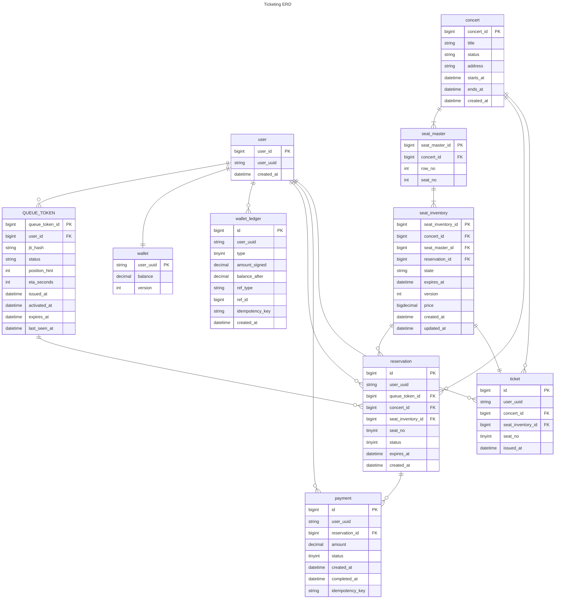

```mermaid
---
title: Ticketing ERD
---
erDiagram
    user {
        bigint user_id PK
        string user_uuid
        datetime created_at
    }

    QUEUE_TOKEN {
        bigint queue_token_id PK
        bigint user_id FK
        string jti_hash
        string status
        int position_hint
        int eta_seconds
        datetime issued_at
        datetime activated_at
        datetime expires_at
        datetime last_seen_at
    }

    concert {
        bigint concert_id PK
        string title
        string status
        string address
        datetime starts_at
        datetime ends_at
        datetime created_at
    }
    
%%    공연장 좌석 정보
    seat_master {
        bigint seat_master_id PK
        bigint concert_id FK
        int row_no
        int seat_no
    }
    
    seat_inventory {
        bigint seat_inventory_id PK
        bigint concert_id FK
        bigint seat_master_id FK
        bigint reservation_id FK
        string state
        datetime expires_at
        int version
        bigdecimal price
        datetime created_at
        datetime updated_at
%%        hold_token_id   BIGINT NULL
    }

    reservation {
        bigint id PK
        string user_uuid
        bigint queue_token_id FK
        bigint concert_id FK
        bigint seat_inventory_id FK
        tinyint seat_no
        tinyint status
        datetime expires_at
        datetime created_at
    }

    wallet {
        string user_uuid PK
        decimal balance
        int version
    }

    wallet_ledger {
        bigint id PK
        string user_uuid
        tinyint type
        decimal amount_signed
        decimal balance_after
        string ref_type
        bigint ref_id
        string idempotency_key
        datetime created_at
    }

    payment {
        bigint id PK
        string user_uuid
        bigint reservation_id FK
        decimal amount
        tinyint status
        datetime created_at
        datetime completed_at
        string idempotency_key
    }

    ticket {
        bigint id PK
        string user_uuid
        bigint concert_id FK
        bigint seat_inventory_id FK
        tinyint seat_no
        datetime issued_at
    }

%% 관계
    user ||--o{ QUEUE_TOKEN: ""
    concert ||--|{ seat_master: ""
    seat_master ||--|{ seat_inventory: ""
    seat_inventory ||--o{ reservation: ""
    QUEUE_TOKEN ||--o{ reservation: ""
    concert ||--o{ reservation: ""
    reservation ||--o{ payment: ""
    seat_inventory ||--|| ticket: ""
    concert ||--o{ ticket: ""
    user ||--|| wallet: ""
    user ||--o{ wallet_ledger: ""
    user ||--o{ reservation: ""
    user ||--o{ payment: ""
    user ||--o{ ticket: ""

```