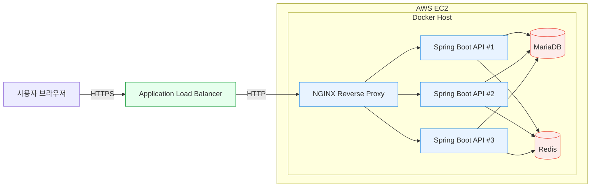

```mermaid
flowchart LR
    user[사용자 브라우저] -->|HTTPS| alb[Application Load Balancer]
    alb -->|HTTP| nginx[NGINX Reverse Proxy]

subgraph aws[AWS EC2]
    direction TB
    subgraph docker_host[Docker Host]
        direction LR
        nginx --> api1[Spring Boot API #1]
        nginx --> api2[Spring Boot API #2]
        nginx --> api3[Spring Boot API #3]
        
        api1 --> mariadb[(MariaDB)]
        api2 --> mariadb
        api3 --> mariadb
        
        api1 --> redis[(Redis)]
        api2 --> redis
        api3 --> redis
    end
end

classDef svc fill:#e8f3ff,stroke:#1e88e5,stroke-width:1px;
classDef data fill:#fdecea,stroke:#ea4335,stroke-width:1px;
classDef edge fill:#e6ffed,stroke:#34a853,stroke-width:1px;

class nginx,api1,api2,api3 svc;
class mariadb,redis data;
class alb edge;
    
    
```
